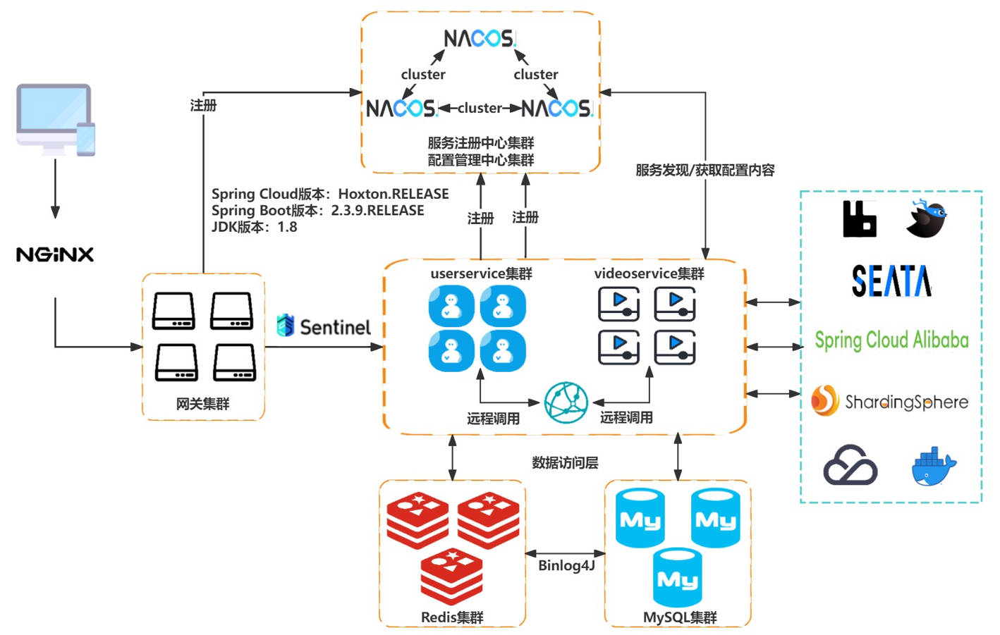
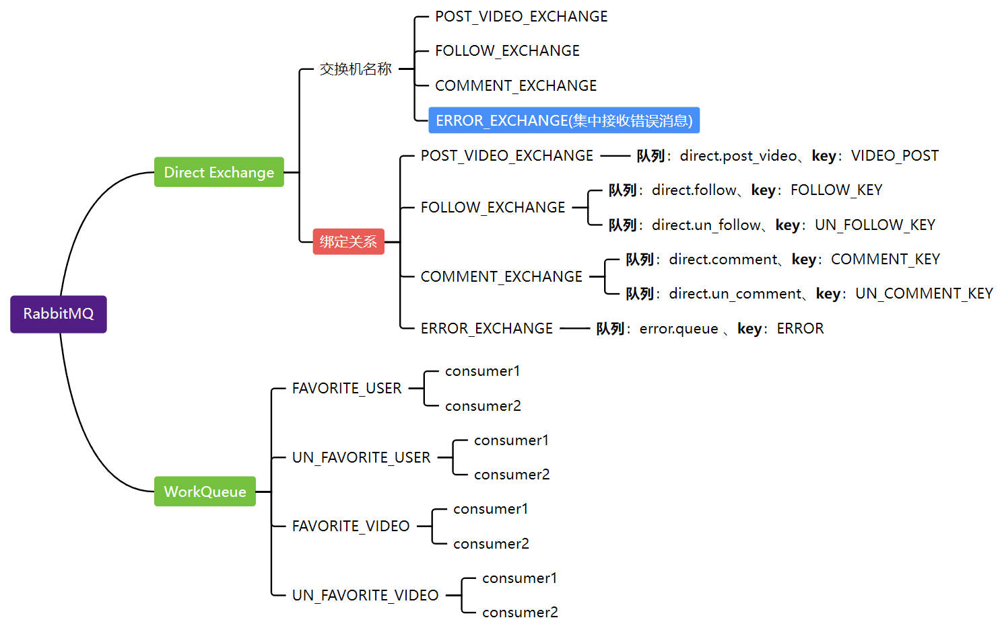

<h2 align="center" style="color:#009688;font-weight: 800">极简版抖音指南🧭</h2>

<p align="center">
	<strong>微服务版、Java实现</strong>
</p>

### ⛳⛳前言

本仓库是字节青训营的官方项目，开发文档参考《[在线接口文档分享](https://apifox.com/apidoc/shared-7b33652d-6080-41bb-a70e-7a165d55daae)》以及字节官方提供的《[极简版抖音App使用说明-青训营版](https://bytedance.larkoffice.com/docs/doccnM9KkBAdyDhg8qaeGlIz7S7)》

### :sun_with_face::sun_with_face:项目特点

1. 使用主流的[**微服务**](https://spring.io/projects/spring-cloud)架构进行开发，降低项目的耦合度；
2. 代码风格参考《[**Java开发手册（黄山版）**](https://github.com/alibaba/p3c/blob/master/Java%E5%BC%80%E5%8F%91%E6%89%8B%E5%86%8C(%E9%BB%84%E5%B1%B1%E7%89%88).pdf)》进行开发，符合大厂开发规范；
3. 使用[**Sharding-JDBC**](https://shardingsphere.apache.org/document/4.1.0/cn/manual/sharding-jdbc/)进行数据层的读写分离+分库分表，提升数据库的性能；
4. 引入[**Seata**](https://seata.apache.org/zh-cn/)解决分布式事务问题，加强程序的健壮性；
5. 引入安全性更高的[**KDF**](https://mp.weixin.qq.com/s/TcGnktKbZK9hrvNvvO7kgQ)算法加强用户登录注册的验证环节，防止用户密码被暴力破解或者出现彩虹表攻击；
6. [**RabbitMQ**](https://www.rabbitmq.com/)实现流量削峰，提高系统的可用性；
7. 使用存储默认值的形式解决[缓存穿透](https://xiaolincoding.com/redis/cluster/cache_problem.html#%E7%BC%93%E5%AD%98%E7%A9%BF%E9%80%8F)问题
8. 缓存过期值随机打散+Sentinel限流缓解[缓存雪崩](https://xiaolincoding.com/redis/cluster/cache_problem.html#%E7%BC%93%E5%AD%98%E9%9B%AA%E5%B4%A9)问题
9. **多种**模式的缓存同步方案：
   - 同步双写：实时性高的信息同步更新
   - 异步通知：RabbitMQ异步更新缓存
   - 后台监听MySQL日志，实时更新缓存
10. 。。。

### :memo::memo:架构设计

系统整体架构图如下图所示：



> 需要部署的项目中间件全部使用docker部署到了服务器中

### :rabbit::rabbit:RabbitMQ设计

项目中涉及到的交换机和队列以及对应的`RoutingKey`如下图所示:



> 需要注意的是，项目中专门定义了一个交换机和队列来接收超过重试次数的消息**集中**进行处理

### :bug::bug:代码结构

整个项目的结构如下：

```sh
tiktok:.
    ├─common
    │  └─src
    │   ├─config
    │   ├─constant
    │   ├─exception
    │   ├─feign
    │   │  └─fallback
    │   ├─result
    │   └─utils
    ├─gateway
    │  └─src
    │  │  ├─config
    │  │  └─filter
    │  └─resources
    ├─resource
    │  ├─img
    │  └─static
    │      ├─cover
    │      └─video
    ├─user-service
    │  └─src
    │  │  ├─config
    │  │  ├─controller
    │  │  ├─dto
    │  │  ├─entity
    │  │  ├─interceptor
    │  │  ├─listener
    │  │  ├─mapper
    │  │  └─service
    │  │      └─impl
    │  └─resources
    └─video-service
        └─src
        │  ├─config
        │  ├─controller
        │  ├─dto
        │  ├─entity
        │  ├─interceptor
        │  ├─listener
        │  ├─mapper
        │  └─service
        │      └─impl
        └─resources
```

### :runner::runner:项目运行

下载本项目后，需要在各个微服务模块的`application.txt`的后缀名换成`.yml`，之后将每个中间件对应的**地址**替换成自己需要的，然后加上腾讯云cos需要的配置项，例如：

```yml
# 腾讯云上传文件的配置
tencent:
  cos:
    secretId: yourSecertId
    secretKey: yourSecretKey
    bucketName: yourBucketName
    region: ap-beijing
```

